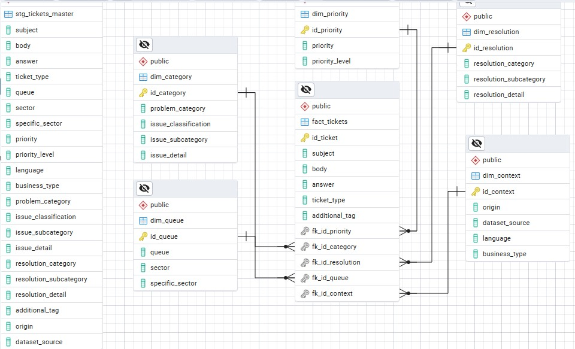

Tipo de Tabla	Nombre de la Tabla	Columnas Clave / Atributos

Dimensión	dim_fecha	id_fecha (PK), dia, mes, año, etc.
Dimensión	dim_prioridad	id_prioridad (PK), prioridad (descripción), nivel_prioridad
Dimensión	dim_categoria	id_categoria (PK), categoria, subcategoria, detalle_categoria, detalle_incidencia
Dimensión	dim_cola	id_cola (PK), cola (queue)

Hechos	fact_tickets	id_ticket (PK), FKs a dimensiones, asunto, cuerpo, idioma, respuesta, tipo, info_adicional, etiquetas_sistema

